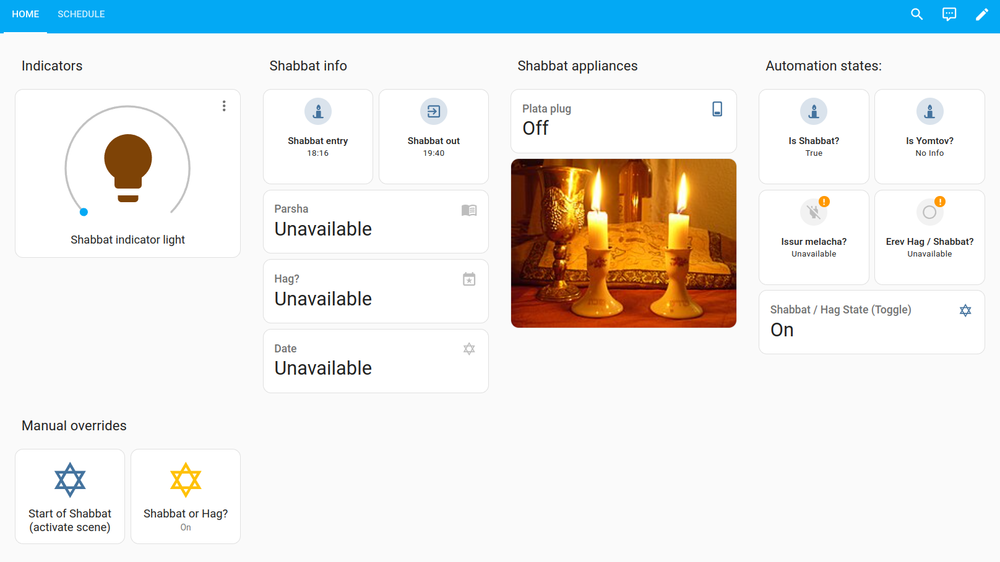

# Home Assistant Shabbat & Yom Tov Dashboard

The purpose of this repository is to share my Shabbat and Yom Tov Home Assistant dashboards as I tweak and improve them.

If you want to replicate the design you're (obviously) going to need to tweak the values in the YAML. As I don't own the copyright to them I won't include the photos I'm using but ... they should be pretty self-explanatory and interchangeable (like the Shabbat candles!).

The modifications I've made to make my dashboard work should be documented elsewhere. 

For instance, I documented the helper I used to roll HebCal's two Shabbat and Yom Tov sensors into one toggle here (either state turns the toggle on and when the states turn off so does the toggle).

https://medium.com/daniels-tech-world/shabbat-yom-tov-home-assistant-automations-part-2-helper-configuration-35ddc2be1cc1

<<<<<<< HEAD
**Notation**

I'm using the notation V1V1 for "point" updates (ie, V1.1, V1.2, etc)

The YAML files are nested under the update folder.

=======
>>>>>>> d69738bdb1036aafe33bcc307a6009c3912d544b

